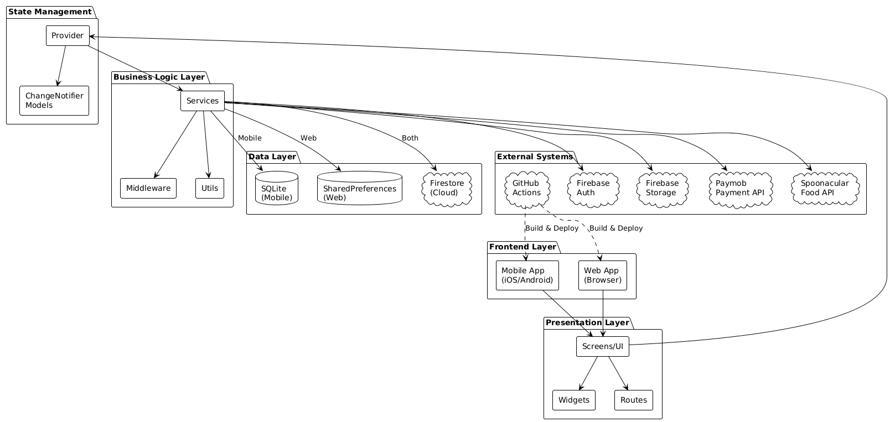
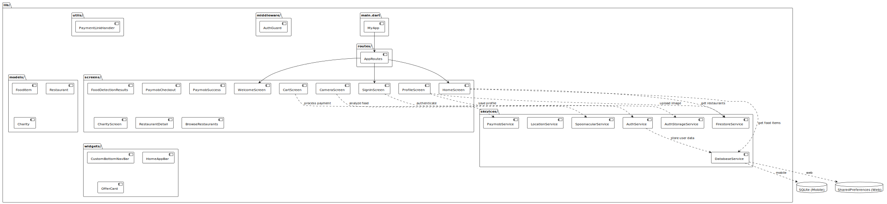
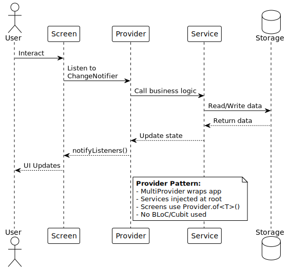
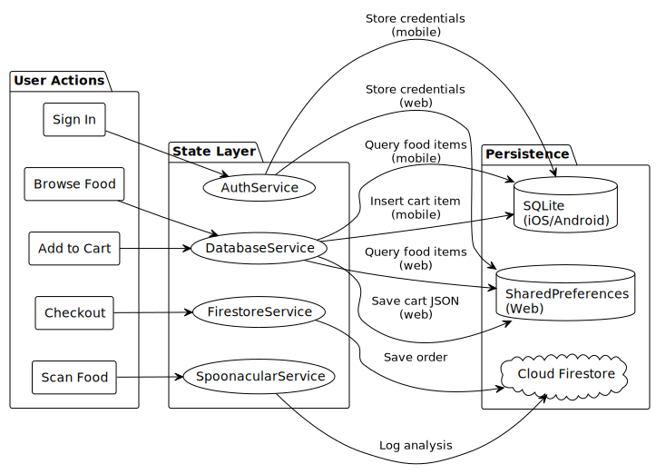
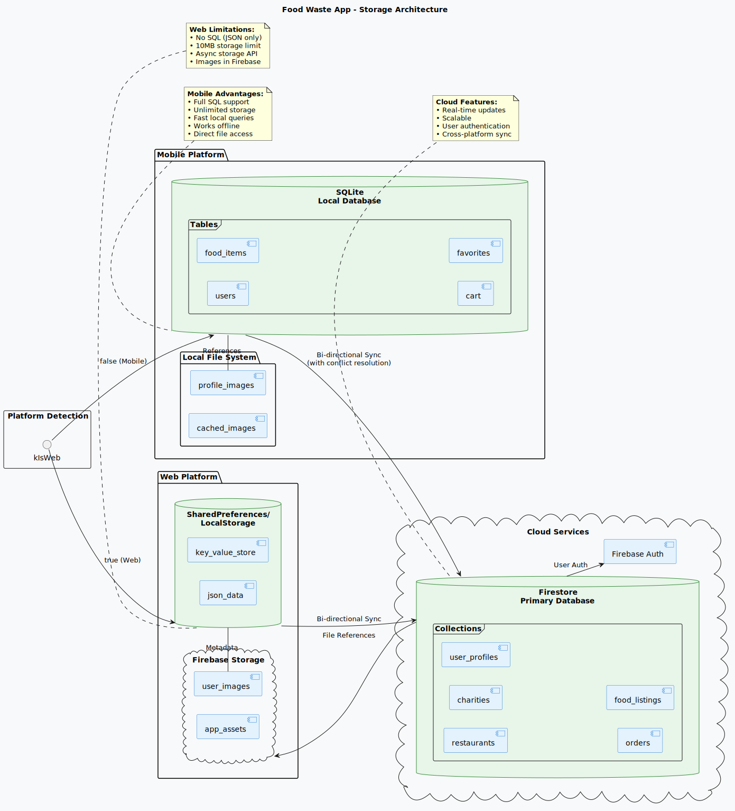
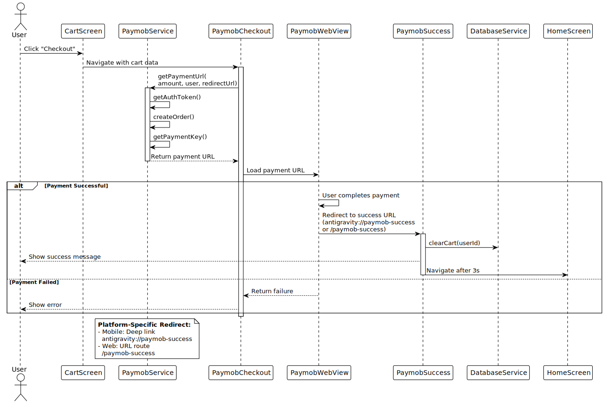
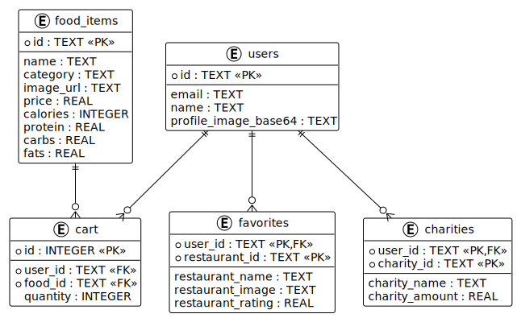

# Nourish App - Software Architecture Document

## Table of Contents
1. [System Overview](#system-overview)
2. [Architecture Diagrams](#architecture-diagrams)
3. [State Management](#state-management)
4. [Data Flow](#data-flow)
5. [Storage Architecture](#storage-architecture)
6. [External Systems](#external-systems)
7. [Feature Modules](#feature-modules)
8. [CI/CD Pipeline](#cicd-pipeline)

---

## System Overview

**Nourish** is a Flutter-based mobile and web application that helps users discover restaurants, analyze food nutrition, make payments, and support charities. The app is built for **iOS, Android, and Web** platforms.

### Technology Stack

| Category | Technology |
|----------|-----------|
| **Framework** | Flutter 3.9.2 |
| **Language** | Dart |
| **State Management** | Provider (ver 6.1.2) |
| **Mobile Database** | SQLite (sqflite 2.3.0) |
| **Web Storage** | SharedPreferences 2.2.2 |
| **Backend** | Firebase (Firestore, Auth, Storage) |
| **Payment Gateway** | Paymob API |
| **Food Analysis** | Spoonacular API |
| **CI/CD** | GitHub Actions |

---

## Architecture Diagrams

###  1. High-Level System Architecture





### 2. Detailed Component Architecture



### 3. State Management Flow (Provider Pattern)



### 4. Data Flow Architecture




### 5. Storage Strategy



### 6. Payment Flow (Paymob Integration)
 


## State Management

### Provider Pattern Architecture

**Nourish uses the Provider package for state management** (NOT BLoC or Cubit).

#### Why Provider?

| Feature | Provider | BLoC/Cubit |
|---------|----------|-----------|
| **Complexity** | Simple | Complex |
| **Boilerplate** | Minimal | High |
| **Learning Curve** | Easy | Steep |
| **Use Case** | Perfect for this app | Overkill |

#### Implementation

**1. Provider Setup (main.dart)**

```dart
// Services are provided at the root level
runApp(
  MultiProvider(
    providers: [
      Provider<FirestoreService>(create: (_) => FirestoreService()),
      Provider<AuthService>(create: (_) => AuthService()),
      Provider<DatabaseService>(create: (_) => DatabaseService()),
    ],
    child: MyApp(cameras: cameras),
  ),
);
```

**2. Consuming Services in Screens**

```dart
// Screens access services via Provider.of<T>()
final authService = Provider.of<AuthService>(context, listen: false);
final dbService = Provider.of<DatabaseService>(context, listen: false);

// Call service methods
final userId = await authService.getStoredUserId();
final cartItems = await dbService.getCartItems(userId);
```

**3. State Updates**

State changes happen through **service method calls**, NOT through ChangeNotifier:

```dart
// Adding to cart
await dbService.addToCart(userId, foodItem);

// UI rebuilds because setState() is called in the widget
setState(() {
  // Trigger rebuild
});
```

#### Provider Tree Structure

```
MultiProvider (root)
├── FirestoreService
├── AuthService
└── DatabaseService
    ├── HomeScreen
    │   ├── Get food items
    │   └── Get restaurants
    ├── CartScreen
    │   ├── Get cart items
    │   └── Clear cart
    └── ProfileScreen
        ├── Get favorites
        └── Update profile
```

---

## Data Flow

### Request-Response Flow

```
User Action → Screen → Provider.of<Service> → Service Method → Storage/API
                ↑                                                    ↓
                └────────────← setState() ←─────── Return Data ←────┘
```

### Example: Adding Item to Cart

1. **User** clicks "Add to Cart" button
2. **CartScreen** calls `Provider.of<DatabaseService>()`
3. **DatabaseService** determines platform (mobile/web)
4. **Mobile**: Executes SQL `INSERT INTO cart`
5. **Web**: Encodes item as JSON, saves to SharedPreferences
6. **Service** returns success
7. **Screen** calls `setState()` to rebuild UI
8. **UI** shows updated cart count

---

## Storage Architecture

### Platform-Specific Implementation

| Feature | Mobile (SQLite) | Web (SharedPreferences) |
|---------|----------------|------------------------|
| **User Auth** | `users` table | `user_id`, `user_email` keys |
| **Food Items** | `food_items` table | `food_items_json` key |
| **Cart** | `cart` table with relations | `cart_json` array |
| **Favorites** | `favorites` table | `favorites_json` array |
| **Profile Images** | Local file system | Firebase Storage URL |
| **Complex Queries** | ✅ SQL JOIN, WHERE | ❌ Manual filtering |
| **Size Limit** | Unlimited | ~10MB |
| **Performance** | Fast | Moderate |

### Database Schema (Mobile - SQLite)

```sql
CREATE TABLE users (
  id TEXT PRIMARY KEY,
  email TEXT,
  name TEXT,
  profile_image_base64 TEXT
);

CREATE TABLE food_items (
  id TEXT PRIMARY KEY,
  name TEXT,
  category TEXT,
  image_url TEXT,
  price REAL,
  calories INTEGER,
  protein REAL,
  carbs REAL,
  fats REAL
);

CREATE TABLE cart (
  id INTEGER PRIMARY KEY AUTOINCREMENT,
  user_id TEXT,
  food_id TEXT,
  quantity INTEGER,
  FOREIGN KEY (user_id) REFERENCES users(id),
  FOREIGN KEY (food_id) REFERENCES food_items(id)
);

CREATE TABLE favorites (
  user_id TEXT,
  restaurant_id TEXT,
  restaurant_name TEXT,
  restaurant_image TEXT,
  restaurant_rating REAL,
  PRIMARY KEY (user_id, restaurant_id)
);

CREATE TABLE charities (
  user_id TEXT,
  charity_id TEXT,
  charity_name TEXT,
  charity_amount REAL,
  PRIMARY KEY (user_id, charity_id)
);
```

### Web Storage Structure (SharedPreferences)

```json
{
  "user_id": "hPm8rmnDvTOzhNAojrmLTHKtOkM2",
  "user_email": "user@example.com",
  "user_name": "John Doe",
  "cart_json": "[{\"food_id\":\"1\",\"quantity\":2}]",
  "favorites_json": "[{\"restaurant_id\":\"res1\",\"name\":\"Pizza Place\"}]",
  "charities_json": "[{\"charity_id\":\"ch1\",\"amount\":10.0}]"
}
```

### Cloud Storage (Firestore)

```
restaurants/
  ├── {restaurant_id}/
  │     ├── name: "Pizza Hut"
  │     ├── rating: 4.5
  │     ├── reviews: 1200
  │     ├── tags: ["Italian", "Fast Food"]
  │     └── image: "https://..."

charities/
  ├── {charity_id}/
  │     ├── name: "Food Bank Egypt"
  │     ├── description: "..."
  │     └── impact: "Feeds 100 families/month"

user_profiles/
  ├── {user_id}/
  │     ├── email: "user@example.com"
  │     ├── name: "John Doe"
  │     └── profile_image_url: "gs://..."

orders/
  ├── {order_id}/
  │     ├── user_id: "..."
  │     ├── amount: 150.0
  │     ├── status: "completed"
  │     └── timestamp: "2024-12-05T00:00:00Z"
```

---

## External Systems

### 1. Firebase Services

#### Firebase Authentication
- **Purpose**: User sign-in/sign-up with email/password and Google Sign-In
- **SDK**: `firebase_auth: ^5.7.0`
- **Implementation**: `lib/services/auth_service.dart`
- **Flow**:
  1. User enters credentials
  2. AuthService calls Firebase Auth
  3. Firebase returns UID + token
  4. App stores user session locally

#### Cloud Firestore
- **Purpose**: Store restaurants, charities, orders
- **SDK**: `cloud_firestore: ^5.5.0`
- **Implementation**: `lib/services/firestore_service.dart`
- **Collections**:
  - `restaurants`: Restaurant data
  - `charities`: Charity information
  - `user_profiles`: User profiles (web)
  - `orders`: Payment records

#### Firebase Storage
- **Purpose**: Store user profile images (web only)
- **SDK**: `firebase_storage: ^12.4.10`
- **Implementation**: `lib/services/firestore_service.dart`
- **Bucket**: `gs://nourish-app.appspot.com`

### 2. Paymob Payment Gateway

- **Purpose**: Process payments for food orders
- **API**: REST API
- **Implementation**: `lib/services/paymob_service.dart`
- **Integration Flow**:
  ```
  1. Get Auth Token → 2. Create Order → 3. Get Payment Key → 4. Load iFrame → 5. Redirect
  ```
- **Configuration**:
  - API Key: Stored in `paymob_service.dart`
  - Integration ID: `4829834`
  - iFrame ID: `867265`

- **Platform Handling**:
  - **Mobile**: Deep link `antigravity://paymob-success`
  - **Web**: Web route `/paymob-success`

### 3. Spoonacular Food API

- **Purpose**: Analyze food images for nutrition info
- **API**: REST API
- **Implementation**: `lib/services/spoonacular_service.dart`
- **Endpoints Used**:
  - `POST /food/images/analyze`: Analyze uploaded food images
- **Rate Limits**: 150 requests/day (free tier)
- **Response**: JSON with calories, protein, carbs, fats, ingredients

### 4. GitHub Actions (CI/CD)

- **Purpose**: Automated testing, linting, building
- **Configuration**: `.github/workflows/ci.yml`
- **Pipeline Steps**:
  1. Checkout code
  2. Setup Java (for Android build)
  3. Install Flutter
  4. Run `flutter doctor`
  5. Get dependencies (`flutter pub get`)
  6. **Format check** (`dart format`)
  7. **Static analysis** (`flutter analyze`)
  8. **Run tests** (`flutter test --coverage`)
  9. **Build Android APK** (`flutter build apk --debug`)
  10. **Build Web** (`flutter build web`)
  11. Upload coverage reports

- **Triggers**:
  - Push to `main` or `develop` branches
  - Pull requests to `main` or `develop`

---

## Feature Modules

### Module Structure

```
lib/
├── screens/          # UI Screens (15 screens)
├── services/         # Business logic (7 services)
├── models/           # Data models (3 models)
├── widgets/          # Reusable UI components (3 widgets)
├── routes/           # Navigation (app_routes.dart)
├── middleware/       # Auth guard
└── utils/            # Helpers (payment_link_handler.dart)
```

### Core Features

#### 1. Authentication Module

**Files:**
- `screens/signin_screen.dart`
- `screens/create_account_screen.dart`
- `screens/welcome_screen.dart`
- `services/auth_service.dart`
- `services/auth_storage_service.dart`
- `middleware/auth_guard.dart`

**Functionality:**
- Email/password authentication
- Google Sign-In
- Session persistence
- Route protection

#### 2. Food Discovery Module

**Files:**
- `screens/home_screen.dart`
- `screens/food_details_screen.dart`
- `screens/browse_restaurants_screen.dart`
- `screens/restaurant_detail_screen.dart`
- `services/database_service.dart`
- `services/firestore_service.dart`
- `models/food_item_model.dart`
- `models/restaurant_model.dart`

**Functionality:**
- Browse food items
- View food details (nutrition, price)
- Search restaurants
- View restaurant details
- Add to favorites

#### 3. Shopping Cart Module

**Files:**
- `screens/cart_screen.dart`
- `services/database_service.dart`

**Functionality:**
- Add items to cart
- Update quantities
- Remove items
- Calculate total
- Platform-specific storage (SQLite/SharedPreferences)

#### 4. Payment Module

**Files:**
- `screens/paymob_checkout_screen.dart`
- `screens/paymob_success_screen.dart`
- `screens/paymob_webview.dart`
- `screens/paymob_webview_mobile.dart` (mobile)
- `screens/paymob_webview_web.dart` (web)
- `services/paymob_service.dart`
- `services/iframe_bridge.dart` (web communication)
- `utils/payment_link_handler.dart`

**Functionality:**
- Initiate payment with Paymob
- Load payment iFrame/WebView
- Handle payment success/failure
- Deep link handling (mobile)
- Web route handling (web)
- Clear cart on success

#### 5. Food Analysis Module

**Files:**
- `screens/camera_screen.dart`
- `screens/food_detection_results_screen.dart`
- `screens/profile_screen_food_modal.dart`
- `services/spoonacular_service.dart`

**Functionality:**
- Take photo with camera
- Pick image from gallery
- Upload to Spoonacular API
- Display nutrition analysis:
  - Detected ingredients
  - Calories
  - Protein, carbs, fats
- Cross-platform image handling (file vs bytes)

#### 6. Charity Module

**Files:**
- `screens/charity_screen.dart`
- `services/database_service.dart`
- `models/charity_model.dart`

**Functionality:**
- Browse charities
- Donate to charities
- Track donations
- Store locally + Firestore

#### 7. Profile Module

**Files:**
- `screens/profile_screen.dart`
- `screens/subscription_screen.dart`
- `services/auth_storage_service.dart`
- `services/firestore_service.dart`

**Functionality:**
- View/edit profile
- Upload profile picture
- View favorites
- Sign out
- Platform-specific image storage

#### 8. Navigation Module

**Files:**
- `routes/app_routes.dart`
- `widgets/custom_bottom_nav_bar.dart`
- `main.dart`

**Functionality:**
- Named routes
- Bottom navigation
- Deep linking (app_links)
- Route guards (AuthGuard)

---

## CI/CD Pipeline

### GitHub Actions Workflow

**File**: `.github/workflows/ci.yml`

#### Workflow Configuration

```yaml
name: CI

on:
  push:
    branches: [ main, develop ]
  pull_request:
    branches: [ main, develop ]

jobs:
  build-and-test:
    runs-on: ubuntu-latest
```

#### Pipeline Stages

| Stage | Command | Purpose | Fails Build? |
|-------|---------|---------|--------------|
| **Checkout** | `actions/checkout@v4` | Clone repository | N/A |
| **Setup Java** | `actions/setup-java@v4` | Install Java 17 | N/A |
| **Install Flutter** | `subosito/flutter-action@v2` | Install Flutter stable | N/A |
| **Flutter Doctor** | `flutter doctor -v` | Verify setup | No |
| **Cache Packages** | `actions/cache@v4` | Cache dependencies | No |
| **Get Dependencies** | `flutter pub get` | Download packages | Yes |
| **Format Check** | `dart format --set-exit-if-changed` | Check code formatting | Yes |
| **Static Analysis** | `flutter analyze --no-fatal-infos` | Lint code | No* |
| **Run Tests** | `flutter test --coverage` | Execute unit/widget tests | Yes |
| **Build Android** | `flutter build apk --debug` | Build Android APK | Yes |
| **Build Web** | `flutter build web` | Build web bundle | Yes |
| **Upload Coverage** | `actions/upload-artifact@v4` | Save coverage report | No |

*Analysis shows warnings but doesn't fail build (`|| exit 0`)

#### Test Coverage

**Test Files:**
- `test/payment_link_handler_test.dart` - Unit tests for payment link parsing
- `test/widget/login_test.dart` - Widget tests for login validation
- `test/widget/navigation_test.dart` - Navigation flow tests
- `test/widget/webview_bridge_test.dart` - WebView URL parsing tests

**Coverage Output**: `coverage/lcov.info`

#### Branch Protection (Recommended Setup)

**Protected Branch**: `main`

**Rules:**
- ✅ Require pull request before merging
- ✅ Require status checks to pass (`build-and-test`)
- ✅ Require approvals: 1
- ✅ Do not allow bypassing

**Workflow:**
```
Developer → Feature Branch → Push → PR → CI Runs → Pass ✅ → Review → Merge
                                                  ↓
                                               Fail ❌ → Fix → Push → CI Runs
```

---

## System Diagrams


### 10. Database ER Diagram (SQLite - Mobile)



### 11. Sequence Diagram: Complete User Journey


## Performance Considerations

### Mobile (SQLite)
- **Fast queries**: Indexed primary keys
- **Joins**: Efficient foreign key relationships
- **Batch operations**: `batch.insert()` for multiple items
- **Lazy loading**: Load data on-demand

### Web (SharedPreferences)
- **Limitations**: 
  - No SQL queries
  - Manual JSON parsing
  - Size limit ~10MB
  - Slower than SQLite
- **Optimizations**:
  - Cache parsed data
  - Minimize reads/writes
  - Use Firestore for large datasets

### Network
- **HTTP caching**: Reuse API responses
- **Image caching**: `CachedNetworkImage` widget
- **Pagination**: Load restaurants in chunks
- **Retry logic**: Handle network failures

---

## Security

1. **Authentication**: Firebase Auth with session tokens
2. **API Keys**: Stored in code (should be moved to env vars for production)
3. **Route Protection**: AuthGuard middleware
4. **Data Validation**: Form validators on all inputs
5. **HTTPS**: All external API calls use HTTPS
6. **Deep Link Verification**: Validate payment redirect parameters

---

## Future Enhancements

1. **State Management**: Migrate to Riverpod for better dependency injection
2. **Environment Variables**: Move API keys to `.env` files
3. **Backend**: Add custom backend for business logic
4. **Real-time**: Use Firestore real-time listeners
5. **Analytics**: Add Firebase Analytics
6. **Push Notifications**: Firebase Cloud Messaging
7. **Offline Support**: Implement offline-first with sync
8. **Testing**: Increase coverage to 80%+

---

## Conclusion

Nourish is a **well-architected Flutter application** that:
- ✅ Uses **Provider** for simple state management
- ✅ Implements **platform-specific storage** (SQLite/SharedPreferences)
- ✅ Integrates with **multiple external services** (Firebase, Paymob, Spoonacular)
- ✅ Has a **robust CI/CD pipeline** with GitHub Actions
- ✅ Follows **clean architecture** principles with clear separation of concerns
- ✅ Supports **cross-platform deployment** (iOS, Android, Web)

The architecture is **production-ready** and scales well for a food discovery and ordering application.
