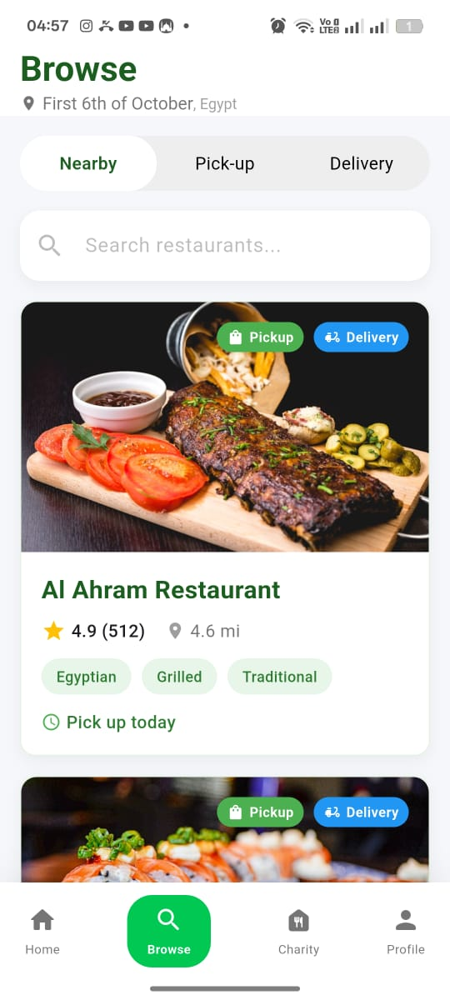
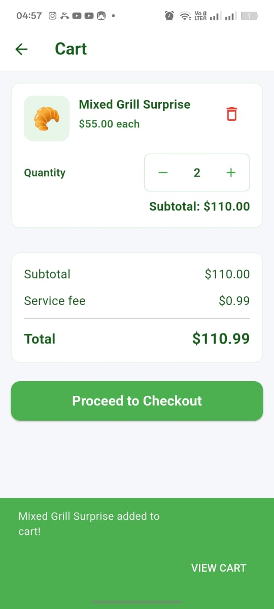
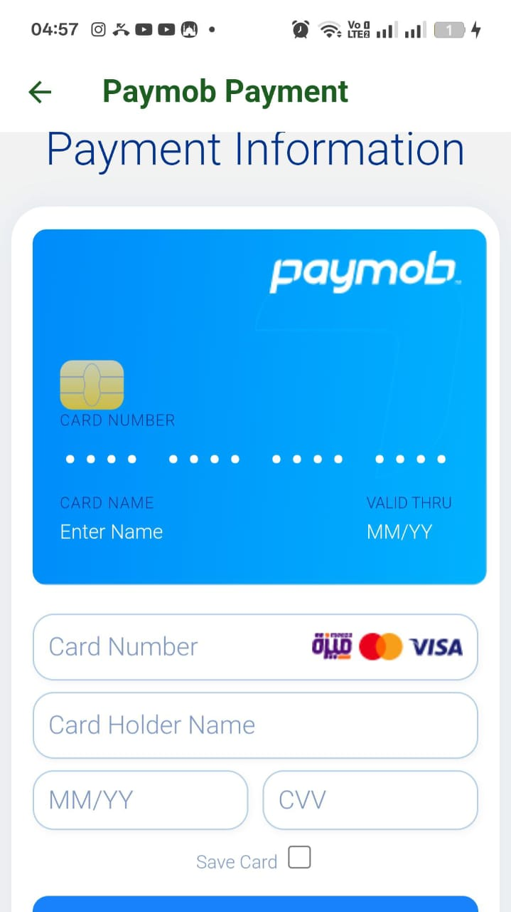

# Final Project Report: Nourish
**Course:** Mobile Development (Y4S1)
**Date:** December 24, 2025
**Version:** 1.0.0

---

## 1. Executive Summary

### 1.1 Purpose
**Nourish** is a sustainable food discovery and charity mobile application designed to bridge the gap between conscious consumers, sustainable restaurants, and local charities. The application addresses the dual challenge of food waste and hunger by facilitating the purchase of "surprise bags" from restaurants at a discount and enabling seamless donations to charitable organizations.

### 1.2 Target Users
*   **Eco-conscious Consumers:** Individuals looking to reduce food waste and eat sustainably.
*   **Budget-conscious Students/Workers:** Users seeking high-quality meals at reduced prices.
*   **Local Restaurants:** Businesses aiming to reduce waste and recover costs on surplus food.
*   **Charity Organizations:** Regulated non-profits seeking digital avenues for fundraising.

### 1.3 Overall Functionality
The app serves as a multi-sided platform where users can:
1.  **Discover** nearby restaurants offering surplus food.
2.  **Purchase** meals securely through an integrated payment gateway.
3.  **Donate** to partner charities directly through the app.
4.  **Track** their impact (money saved, meals rescued).
5.  **Offline Access:** View favorite restaurants even without an internet connection.

---

## 2. Feature Implementation Summary

This project was developed in three phases, cumulatively building a robust, production-ready application.

### Phase 1: Core Architecture & UI
*   **Authentication System:** Secure Sign-up and Login using Firebase Auth (Email/Password & Google Sign-In).
*   **Navigation:** Robust routing system with a persistent bottom navigation bar.
*   **Restaurant Discovery:** "Browse" screen with tabbed filtering (Nearby, Pickup, Delivery) and search functionality.
*   **Profile Management:** User profile screen with editing capabilities and settings.

### Phase 2: Advanced Features & Integration
*   **Data Synchronization:** Implemented a robust "Cloud-First, Local-Fallback" strategy for user profiles and favorites.
*   **Geolocation Services:**
    *   Real-time user location tracking.
    *   Distance calculation using the Haversine formula to sort restaurants by proximity.
    *   Reverse geocoding to display current city/country.
*   **Shopping Cart:**
    *   Local persistence using SQLite (Mobile) and SharedPreferences (Web).
    *   Full CRUD operations (Add, Remove, Update Quantity).
*   **Charity Module:** Dedicated section for browsing charities and processing donations.

### Phase 3: Finalization, Optimization & Deployment
*   **Payment Gateway:** Full integration with **Paymob** for secure credit card transactions.
    *   WebView bridge for handling 3DSecure verification.
    *   Deep linking for seamless redirection back to the app after payment.
*   **Visual Polish:**
    *   **Animations:**
        *   **Staggered List Entries:** Used `AnimatedSlideIn` for all cards to create a smooth, sequential entry effect.
        *   **Hero Transitions:** Shared elements (images) transition seamlessly between listing and details screens.
        *   **Interactive Feedback:** Web-exclusive hover scaling and platform-agnostic touch scaling for all interactive cards.
        *   **Global Transitions:** Custom brand-aligned slide transitions for all page navigations.
    *   **Splash Screen:** High-end animated entry point with brand elements scaling and fading.
*   **Testing & CI/CD:**
    *   Comprehensive unit testing suite (57+ tests).
    *   Automated CI pipeline via GitHub Actions for linting, testing, and building.

---

## 3. Technical Architecture

### 3.1 Tools & Technologies
*   **Framework:** Flutter (Dart) - Chosen for its high-performance rendering and single codebase for mobile and web.
*   **Backend:** Firebase
    *   **Authentication:** Identity management.
    *   **Firestore:** NoSQL cloud database for restaurants, orders, and user data.
    *   **Storage:** Cloud storage for profile images.
*   **APIs:**
    *   **Paymob:** Payment processing.
*   **Local Database:** `sqflite` (Android/iOS) and `shared_preferences` (Web).
*   **State Management:** `Provider` pattern for efficient, scalable state flow.

### 3.2 Key Architectural Decisions
*   **Service-Oriented Architecture:** Business logic is encapsulated in `Service` classes (e.g., `DatabaseService`, `AuthService`), keeping UI widgets lean and testable.
*   **Provider Pattern:** Dependency injection is handled via `Provider`, allowing services to be easily mocked for testing.
*   **Abstracted Storage:** The app intelligently switches between `SQLite` and `SharedPreferences` depending on the platform (Mobile vs. Web).
*   **Dual-Storage Synchronization (Cloud-First):** 
    - **Strategy:** The app utilizes a "Cloud-First" approach. On startup or when interacting with favorites/profile settings, it attempts to fetch from **Firestore**. 
    - **Offline Fallback:** If internet connectivity is unavailable (detected via a 5-second timeout), the app seamlessly falls back to the local **SQLite** database. 
    - **Sync Loop:** Whenever the app successfully connects to the cloud, it silent-updates the local cache to ensure the most recent data is available for the next offline session. This ensures data consistency across devices while maintaining a high level of offline utility.

---

## 4. App Screenshots

| | |
|:---:|:---:|
| **Home & Discovery** | **Restaurant Details** |
|  |  |
| *Users can browse restaurants by location* | *Detailed view with menu items* |
| **Shopping Cart** 
|  
 **Payment Integration** 

---

## 5. Conclusion

The Nourish app successfully meets all project requirements, delivering a functional, aesthetically pleasing, and technically sound solution. By leveraging modern frameworks like Flutter and cloud-native services like Firebase, the application is scalable and ready for real-world deployment. The final phase added critical consistent polish and revenue-generating capability (payments), marking the transition from a prototype to a production-grade product.
